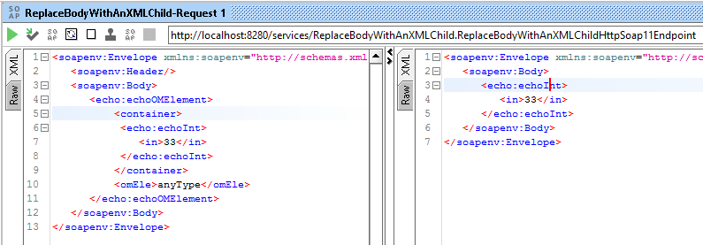

# Enrich Mediator Examples

## Example 1 - ReplaceBodyWithAnXMLChild.xml

Extract part of request body (first child of container element) and convert it to a new body request.
[Source code](./WSO2EnrichMediatorParentProject/EnrichMediatorESB/src/main/synapse-config/proxy-services/ReplaceBodyWithAnXMLChild.xml "ReplaceBodyWithAnXMLChild").

